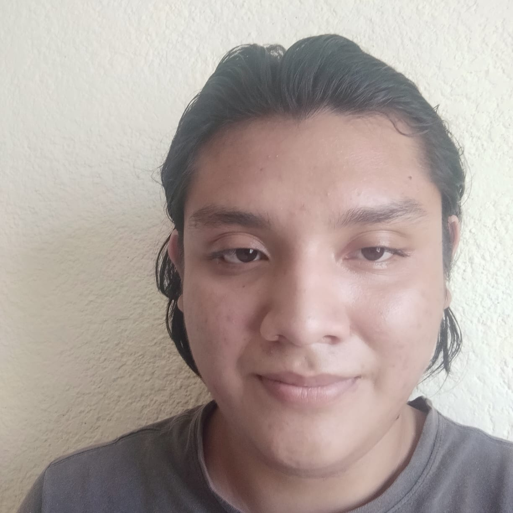

# ProyectoFinalDAWV
Aquí se encuentra alojado el código del programa para la asignatura de desarrollo de aplicaciones web de verano llamada Tienda Fiel.

Integrantes:

1. Cetina Ucan Iván de Jesús.

2. Pacheco Serralta Esteban Alfonso.

3. Us Cachón Dilian Armando.
